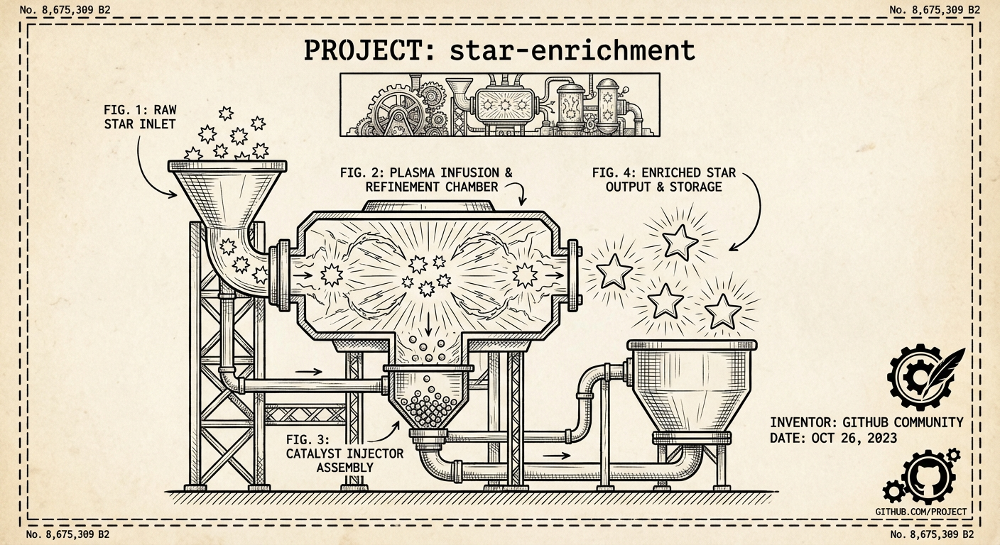

<p align="center">
  
</p>

# Star Enrichment

A CLI tool that fetches GitHub stargazers and enriches their profiles with demographic and professional information using the GitHub API and LLM extraction. Understand who your users are, where they work, and what industries they represent.

## Features

- Fetches all stargazers from any GitHub repository
- Enriches profiles with:
  - Country/region (inferred from location)
  - Current and past employers
  - Industry and company size insights
  - University/education background
  - Professional profiles (LinkedIn, Twitter)
  - Personal website
- Exports to CSV for analysis
- Random sampling for quick repository analysis
- Adaptive rate limiting to stay within GitHub API limits

## Installation

```bash
pnpm install
```

## Configuration

Create a `.env` file:

```env
GITHUB_TOKEN=ghp_...
OPENROUTER_API_KEY=sk-or-...
```

## Usage

### Fetch stargazers

```bash
# Fetch all stargazers from a repo
pnpm cli fetch owner/repo

# Fetch only the last 100 stargazers
pnpm cli fetch owner/repo --limit 100
```

### Enrich profiles

```bash
# Enrich up to 500 pending profiles (default batch size)
pnpm cli enrich owner/repo

# Enrich a specific number of profiles
pnpm cli enrich owner/repo --limit 100

# Enrich a random 10% sample (useful for legitimacy detection)
pnpm cli enrich owner/repo --sample 0.1

# Enrich all pending profiles
pnpm cli enrich owner/repo --sample 1.0
```

### Export to CSV

```bash
# Export to default location (./data/owner-repo/export.csv)
pnpm cli dump owner/repo

# Export to stdout
pnpm cli dump owner/repo -o -

# Export to specific file
pnpm cli dump owner/repo -o ./output.csv
```

## CSV Output Columns

| Column | Description |
|--------|-------------|
| username | GitHub username |
| starred_at | When they starred the repo |
| name | Full name |
| country | Inferred country/region |
| current_employer | Current employer(s) |
| past_employers | Previous employers |
| university | University/education |
| linkedin_url | LinkedIn profile URL |
| twitter_url | Twitter/X profile URL |
| website_url | Personal website |

## Data Storage

Data is stored in DuckDB databases under `./data/<owner>-<repo>/stargazers.db`.

## Rate Limiting

The tool uses adaptive rate limiting:
- Fast mode (100ms delay) when >500 API calls remaining
- Spreads remaining calls evenly when below threshold
- Keeps 20 calls in reserve
- Automatically waits when rate limited

## API Calls Per User

Each enrichment makes 2-4 GitHub API calls:
1. User profile (always)
2. Social accounts (always)
3. User repos (if additional context needed)
4. Repo commits (if additional context needed)

## Architecture

```
/src
  /commands    # CLI command implementations
  /db          # DuckDB connection and schema
  /enrichment  # LLM extraction using OpenRouter
  /github      # GitHub API client with rate limiting
  /worker      # Core fetch and enrich logic
  cli.ts       # CLI entry point
```

## License

ISC
